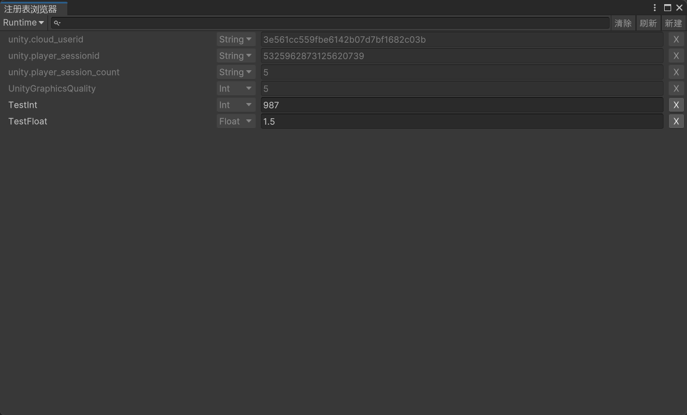
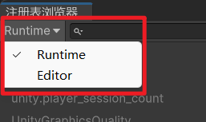
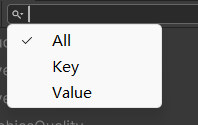

PlayerPrefsBrowser 使用说明
---

## 说明

用于查看项目运行时和仅编辑器模式下的注册表信息.

## 使用说明

1. 点击左上角按钮, 切换运行时还是仅编辑器模式, 相当于代码调用的是 `PlayerPrefs` 还是 `EditorPrefs`.

2. 点击放大镜图标, 显示搜索针对Key还是Value.

3. 清除按钮会清除当前列表中的所有注册表数据, 刷新按钮会刷新当前列表, 显示最新的注册表信息.

4. 新建按钮会打开新建面板, 输入 Key 和 Value 值, 点击确定会创建相应注册表信息.

